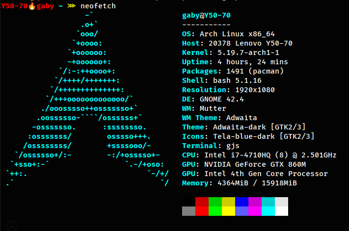
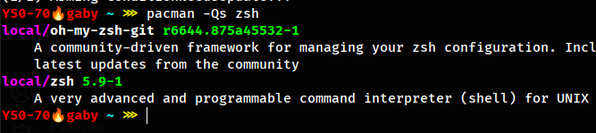

# My steps of completing this lab

Setting up OS:

1) I'm using Arch Linux for 3 years(on this laptop 1 year). Prove:


```bash
$ stat / | grep "Birth" | sed 's/Birth: //g' | cut -b 2-11
2021-09-26

```
2) 
- zsh and oh-my-zsh is installed

but I prefer to use bash, with my custom .bashrc. 

- Using: gcc 12.2.0

- Editor: VSCode - for large files, nano - for small root protected files

3) 
- Build tools (installed together with OS) - ```sudo pacman -S --needed base base-devel git```
- Created Makefile and C-file and enterd directory from terminal
- Type: ```gcc test.c``` or in my case ```make```
- Saved all files
- Procedure to commit and push:
```bash
git fetch
git pull
## took from .bash_history
git add .
git commit -m "lab0 - done )))"
git sta
git status 
git push
```

Note: Had some troubles at start with pushing: ```Support for password authentication was removed on August 13, 2021.``` After that I had to create token based authentification
